# BookNest

BookNest is a modern Hotel Booking Android application built using Jetpack Compose.  
It provides a seamless UI flow starting from onboarding and authentication to browsing hotels, selecting rooms, confirming bookings, completing payments, and checking booking status.

---

## Features

- Splash + Intro navigation
- Signup with phone authentication (OTP verification)
- Home screen with destination entry
- Hotel and room browsing UI
- Room selection with pricing breakdown
- Razorpay secure payment integration
- Transaction summary post-payment
- FAQ / Support section
- Clean Material UI using Jetpack Compose

---

## Tech Stack

| Category | Technology |
|---------|------------|
| Language | Kotlin |
| UI | Jetpack Compose, Material 3 |
| Architecture | MVVM |
| Auth | Firebase Phone Authentication |
| Payments | Razorpay SDK |
| Navigation | Jetpack Navigation Compose |
| State Management | ViewModel, StateFlow |
| Build | Gradle Kotlin DSL |

---

## App Flow & Screenshots

| Step | Screen | Preview |
|------|--------|---------|
| 1 | Splash Screen | 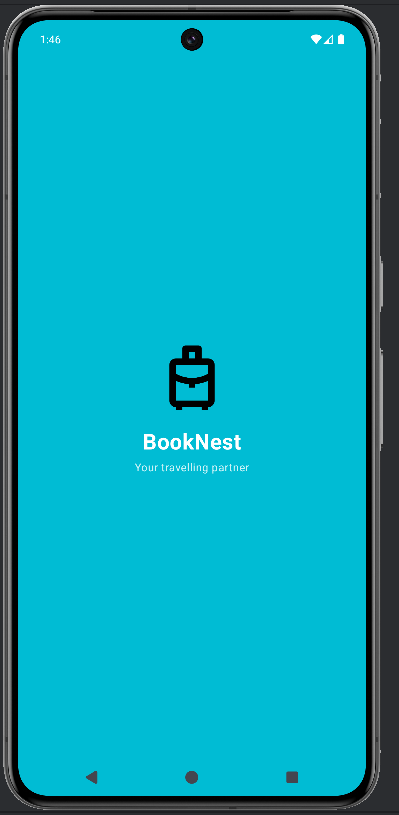 |
| 2 | Signup Screen | 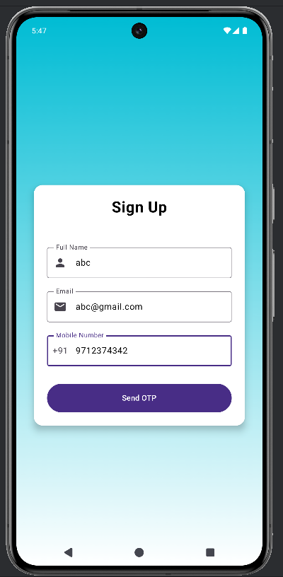 |
| 3 | OTP Verification | 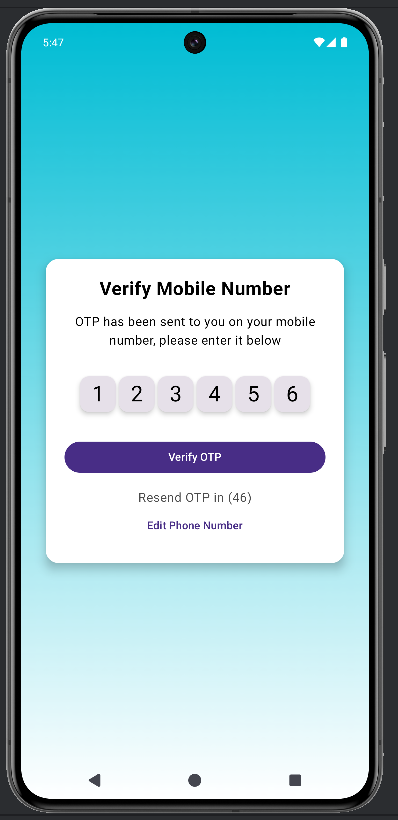 |
| 4 | Homepage (Search Destination) | 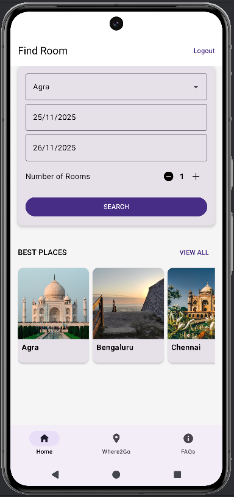 |
| 5 | Hotel Selection Screen | 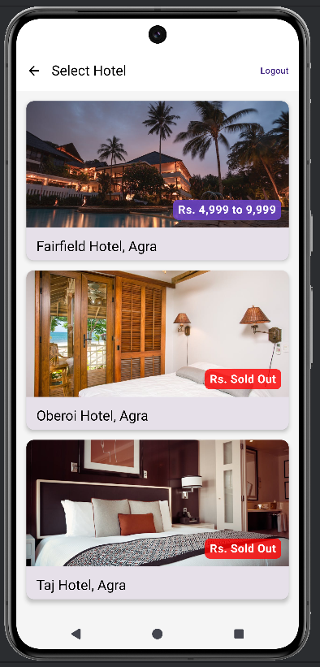 |
| 6 | Room Listing Screen | 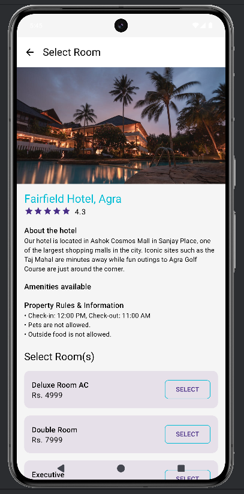 |
| 7 | Room Details Screen | 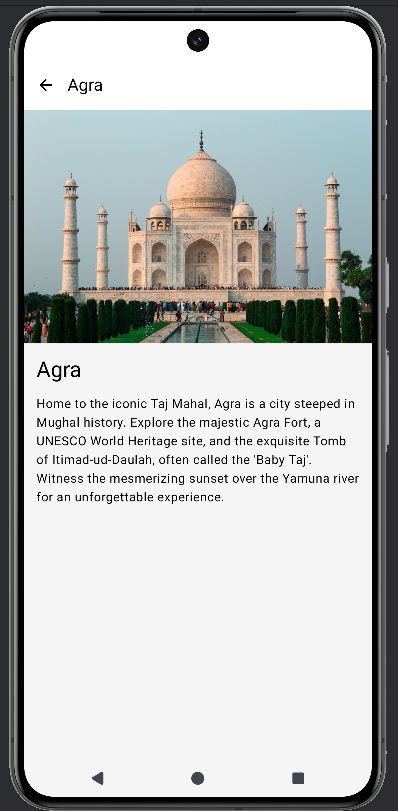 |
| 8 | Checkout Screen |  |
| 9 | Razorpay Payment UI | 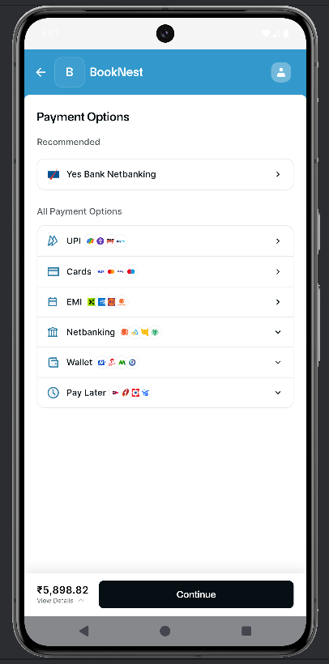 |
| 10 | Transaction Page | 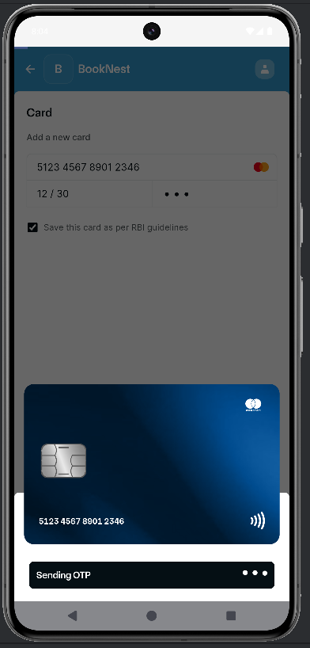 |
| 11 | Payment Success Screen | 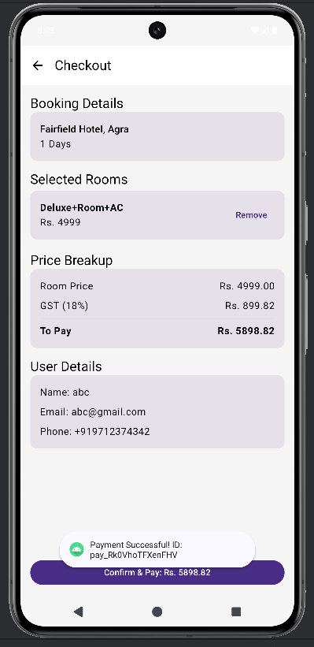 |
| 12 | FAQ / Support Screen | 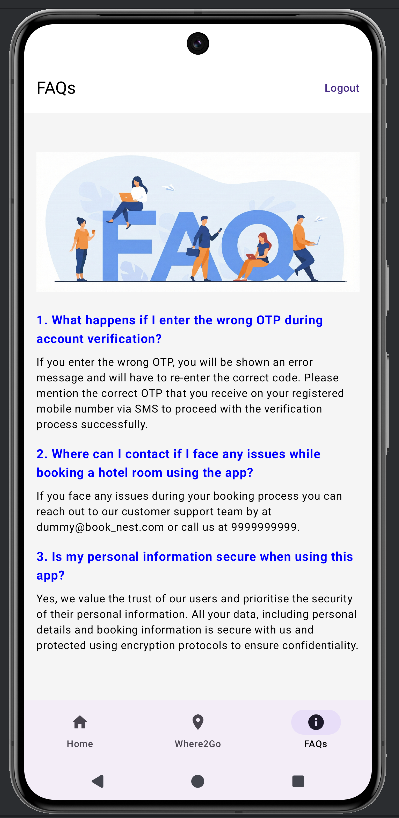 |

## Project Structure

app/
├─ data/
├─ ui/
│ ├─ screens/…
│ ├─ navigation/
├─ util/
├─ MainActivity.kt

## Firebase Requirements
### Enable Phone Authentication

## Razorpay Setup

### Place your test/live key here:

const val RAZORPAY_KEY_ID = "YOUR_KEY"

