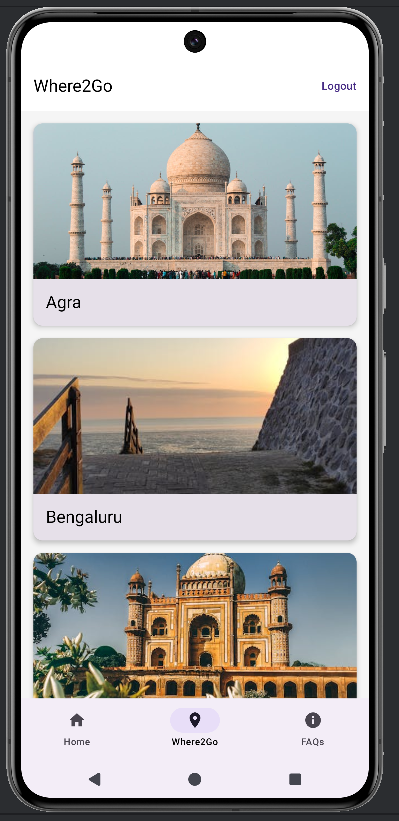

# BookNest - Modern Android Hotel Booking App

BookNest is a feature-rich, native Android application built using **Kotlin** and **Jetpack Compose**. It follows modern Android development practices (MVVM, Hilt, Coroutines) to provide a seamless experience for browsing hotels, viewing details, and making secure bookings with payment integration.

---

## Features

*   **Authentication**: Secure Sign-up and Login using **Firebase Phone Authentication (OTP)**.
*   **Smart Search**: Search hotels by City, Check-in/Check-out dates, and number of rooms.
*   **Hotel Browsing**: View recommended places ("Where2Go") and browse hotels with dynamic pricing breakdown.
*   **Room Selection**: Select specific room types (Standard, Deluxe, Suite) with real-time price calculation including GST.
*   **Secure Payments**: Integrated **Razorpay Payment Gateway** for processing booking transactions.
*   **Booking Management**: View booking summaries and transaction status.
*   **Support**: FAQ section for user assistance.
*   **Modern UI**: Fully responsive Material 3 Design with Dark/Light mode support.

---

## Screenshots

| Onboarding & Auth | Search & Home | Hotel Selection |
|:---:|:---:|:---:|
|   |   |   |

| Room & Details | Checkout & Payment | Status & Support |
|:---:|:---:|:---:|
|   |   |   |

---

## Tech Stack

*   **Language**: [Kotlin](https://kotlinlang.org/)
*   **UI Toolkit**: [Jetpack Compose](https://developer.android.com/jetpack/compose) (Material 3)
*   **Architecture**: MVVM (Model-View-ViewModel) + Clean Architecture principles
*   **Dependency Injection**: [Dagger Hilt](https://dagger.dev/hilt/)
*   **Navigation**: Jetpack Navigation Compose
*   **Backend & Database**: 
    *   Firebase Realtime Database
    *   Firebase Authentication (Phone/OTP)
*   **Image Loading**: [Coil](https://coil-kt.github.io/coil/)
*   **Payments**: Razorpay Android SDK
*   **Asynchronous Programming**: Coroutines & Flow

---

## Project Structure

```text
com.example.booknest
├── data
│   ├── model          # Data classes (Hotel, Room, Place, User)
│   └── repository     # AuthRepository, HomeRepository (Firebase implementation)
├── di                 # Hilt Modules (AppModule)
├── ui
│   ├── navigation     # NavHost and Screen Routes
│   ├── screens        # Composable Screens (Checkout, FindRoom, Details, etc.)
│   └── theme          # Type, Color, Theme (Material 3)
├── util               # Constants, RazorpayManager, Resource wrappers
└── MainActivity.kt    # Entry point & PaymentResultListener
