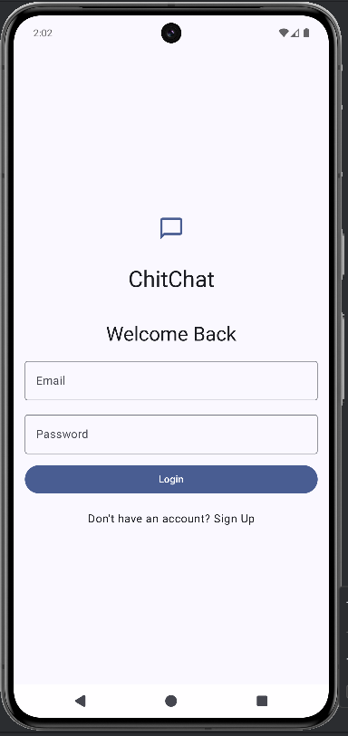
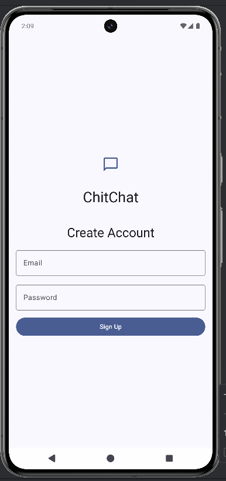
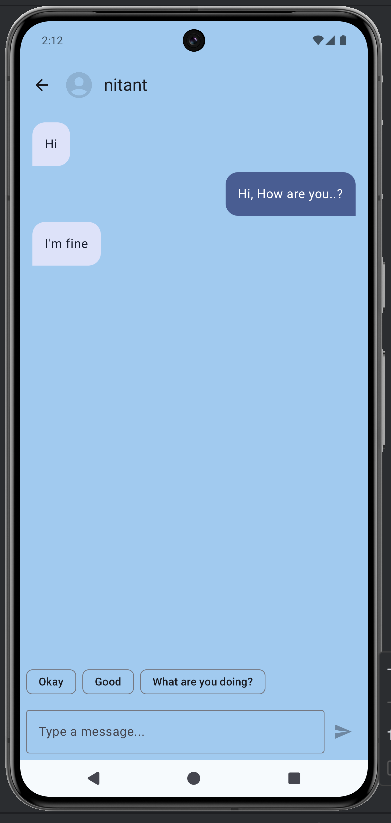
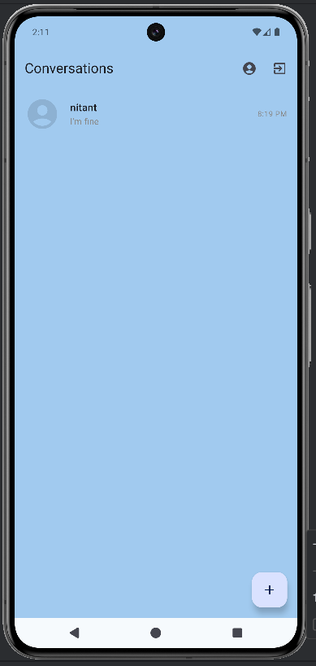
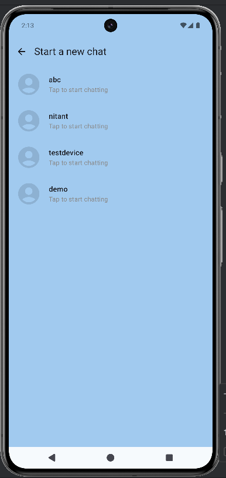
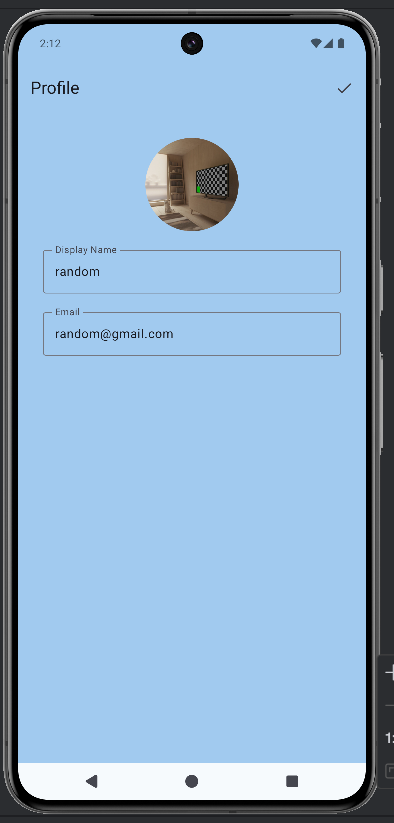
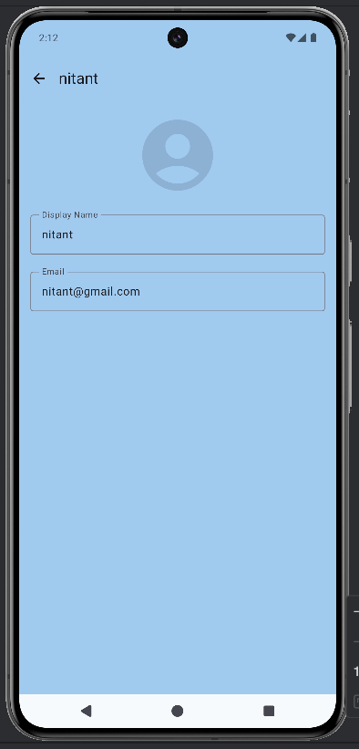
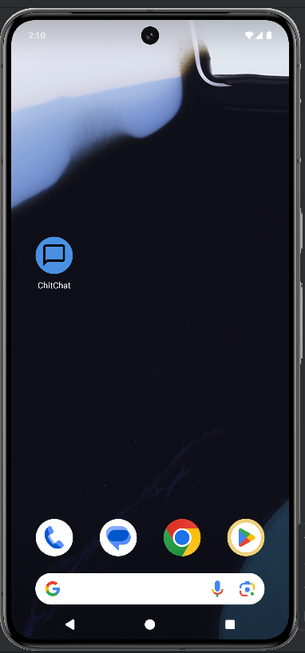

# ChitChatApp

A modern Android real-time chat application featuring user authentication, contact lists, and clean chat UI screens.  
This project demonstrates core messaging functionality using standard Android components and best practices.

## Table of Contents
- Introduction
- Features
- Screenshots
- Installation
- Usage
- Project Structure
- Dependencies
- Configuration
- Troubleshooting
- Contributors
- License

## Introduction

ChitChatApp is a lightweight, easy-to-understand chat application created for Android.  
It enables one-to-one messaging with simple UI screens such as Login, Signup, Profile, Chat, and Conversation.

## Features

- User login and sign-up  
- One-to-one real-time chat  
- Clean UI with multiple screens  
- User profile screens  
- Chat list, new chat view, and conversation view  
- Fast and simple application flow  

## Screenshots

### Login


### Sign-Up


### Chat Screen


### Conversation Screen


### New Chat Screen


### Profile Screen


### Other User Profile


### App Icon


## Installation

Clone the repository:

```
git clone https://github.com/Nitant06/Android-Projects.git
cd Android-Projects/ChitChatApp
```

Open the project in Android Studio:

1. Open Android Studio and select Open Project  
2. Choose the ChitChatApp folder  
3. Allow Gradle to sync  
4. Connect a device or run an emulator  
5. Click Run  

## Usage

1. Install and launch the app  
2. Create an account through the sign-up screen  
3. Log in with valid credentials  
4. View available users or start a new chat  
5. Select a user to begin a conversation  
6. Send and receive messages  
7. View and edit profile settings  

## Project Structure

```
ChitChatApp/
│── app/
│   ├── src/
│   │   ├── main/
│   │   │   ├── java/        
│   │   │   ├── res/         
│   │   │   └── AndroidManifest.xml
│── build.gradle.kts
│── gradle.properties
│── image assets (.png)
│── README.md
```

## Dependencies

Expected dependencies include:

- AndroidX AppCompat  
- Material Components  
- RecyclerView  
- ViewBinding or DataBinding  
- Firebase services (optional depending on setup)  
- Kotlin Standard Library  

## Configuration

If Firebase integration is used:

1. Create a Firebase project  
2. Add your Android package  
3. Download google-services.json  
4. Place it in the following directory:  
```
app/google-services.json
```
5. Enable:
   - Firebase Authentication  
   - Firebase Realtime Database or Firestore  

## Troubleshooting

| Issue | Solution |
|-------|----------|
| Gradle sync failure | Ensure correct SDK versions and update dependencies |
| Authentication not working | Verify configuration in Firebase Console |
| Messages not appearing | Check database rules and message listener logic |
| App crashes on launch | Inspect Logcat for resource or null-pointer issues |

## Contributors

- Nitant06 – Creator and Maintainer  

Contributions through issues and pull requests are welcome.

## License

This project is licensed under the MIT License.  
See the LICENSE file for more details.
